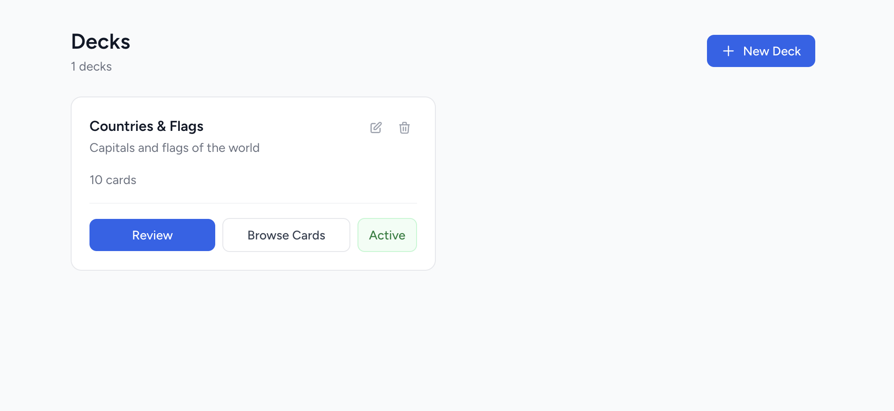
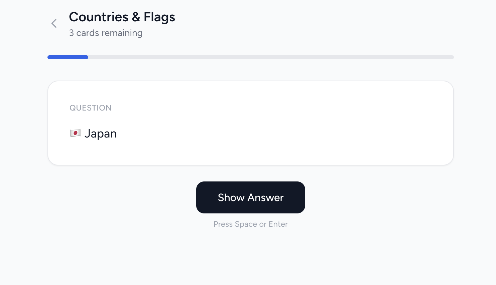

# Spaced Repetition

A personal flashcard app built on the [FSRS](https://github.com/open-spaced-repetition/fsrs4anki) spaced repetition algorithm. Cards are scheduled based on how well you know them — ones you find hard come back sooner, ones you know well get pushed out further.

Built with Laravel, Inertia.js, and Vue 3.

## Screenshots





## Features

- **FSRS scheduling** — more accurate than SM-2, adapts to your actual memory
- **Decks** — organise cards into topic buckets, activate only the ones you want to study
- **Review interface** — rate each card Again / Hard / Good / Easy, progress bar, keyboard shortcuts
- **REST API with Sanctum tokens** — push new cards programmatically (e.g. from Claude Code)
- **Telegram notifications** — get notified when cards are due, no Apple Developer account required
- **Image support** — front and back of cards can include images
- **Dark / light mode**

## Stack

- **Backend**: Laravel 11, SQLite
- **Frontend**: Inertia.js, Vue 3, Tailwind CSS
- **Auth**: Laravel Breeze (email/password)
- **API auth**: Laravel Sanctum
- **Scheduling**: [`scottlaurent/fsrs`](https://packagist.org/packages/scottlaurent/fsrs)

## Setup

```bash
composer install
npm install
cp .env.example .env
php artisan key:generate
php artisan migrate
php artisan serve
npm run dev
```

## API

Authenticate with a Sanctum token (generate one in Settings).

```bash
# Create a deck
POST /api/decks
{"name": "French Vocab", "description": "..."}

# Push cards (batch)
POST /api/decks/{id}/cards
{"cards": [
  {"front_content": "Bonjour", "back_content": "Hello"},
  {"front_content": "Merci",   "back_content": "Thank you"}
]}
```

## Tests

```bash
php artisan test
```

95 tests, 267 assertions.
